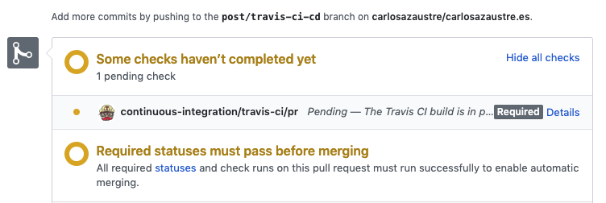
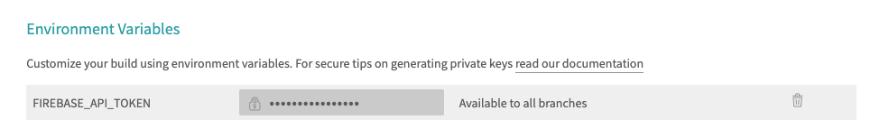

Integración Continua o *Continuous Integration (CI)* y el Despliegue Continuo o *Continuous Deployment* son dos términos que suelen ser mencionados juntos. Se refiere a una serie de tareas repetitivas como son testing, building y desplegar a producción una aplicación/web/software.

Por qué esto es importante. Imagina que tienes el código de tu app o librería *open source* en Github, la gente la usa, descarga, prueba, etc... y en algún momento alguien hace un *fork* y envía una *pull request* para añadir una nueva funcionalidad, corregir algún bug, etc... De primeras, hacer esto manual solo te lleva un poco de tiempo, pero a la larga vas a querer automatizar esto, para centrarte en tu código y delegar las tareas que puedan ser "programadas".

## Cómo funciona
### Integración Continua (CI)
Este proceso sirve para cuando un determinado software está desarrollado por varias personas y queremos automatizar su integración siguiendo el siguiente procedimiento:

1 - Subimos nuestros cambios en una rama a Github
2 - Un proceso se dispara
3 - La rama es descargada, se construye el software, y se corren los tests.
4 - El resultado se envía a dónde decidamos.

Si los test son OK, esto significa que el código puede ser *mergeado* de forma segura.

### Despliegue Continuo (CD)
Este proceso se utiliza mayormente cuando mergeamos una rama a máster:

1 - Se corren los test (idealmente de tipo E2E y más exahustivos que los que se hacen en CI)
2 - Se construye y dependiendo del tipo (app, librería, etc...) se hará una cosa u otra.
3 - Se despliega a un entorno de producción o pre-producción (*staging*, QA,...)

## Cómo configurar este proceso
Hay varias herramientas y *SaaS* que te permiten configurar un entorno de integración y despliegue continuo. En este tutorial te voy a enseñar a configurarlo con Github y [Travis CI](https://travis-ci.org)


### Repositorio
Lo primero que necesitas es tener to código en un repositorio. Si tu proyecto es *open source*, puedes usar [Github](https://github.com) y dejarlo libre sin costo, y eso te permite usar la versión *Open* de Travis, para repositorios públicos. 

### Conectar Travis CI a tu repositorio
Una vez tengas tu repo creado, dirígete a [Travis-CI](https://travis-ci.org) e inicia sesión con tu cuenta de Github, esto permite a Travis ver tu lista de repos.
Busca el que quieres configurar y activalo con el switch a verde y despues clicka en *settings*.


En las *settings* te recomiendo que actives las opciones *Build pushed branches* y *Build pushed pull requests* para que Travis se ejecute en las PR que generes o te envíe y tambien cuando éstas sean aceptadas y mergeadas a master.

### Fichero de configuración
Aquí es donde entra la magia. Con un simple fichero que llamaremos `.travis.yml` y alojaremos en la raiz de nuestro proyecto, vamos a decirle a Travis lo que vamos a hacer. Al principio es un poco lioso, pero voy a explicarte paso a paso como hacerlo:

Veamos un ejemplo muy simple:

```yaml
language: node_js
node_js: "12"
script: 
  - "npm run lint"
  - "npm test"
  - "npm run build"
```

¿Qué estamos diciendo aquí?

- `language`: Si trabajamos con Javascript, lo más común es decirle que es `node_js` y así Travis crea una *maquina virtual* preparada para correr Node.js
- `node_js`: Cómo estamos usando Node/Javascript, tenemos que indicar que versión o versiones nos interesa que se pruebe nuestro software. En este caso le decimos que lo pruebe en `Node.js v12`
- `script`: Aquí pondremos la series de comandos que queramos que se ejecuten en el entorno que crea Travis. como ejemplo he puesto un `npm run lint` que corra ESLint por ejemplo, `npm test` para que ejecute una bateria de tests que tengamos preparados, y por último `npm run build` que contruiría la versión de producción de nuestra app/librería o software en general.

Si alguno de estos scripts fallase, Travis abortaría el proceso. Sólo sera OK si todos los scripts no reportan ningún fallo.

### El proceso de integración continua.
Todo este proceso es para asegurarnos de que no rompemos nada cuado estamos listos para *mergear*.
Para mi caso particular, [este blog](/gatsby-deploy-firebase) estoy usando `yarn`, por tanto, para poder hacer más rápidas las integraciones, podemos cachear el directorio `yarn` o `npm`, o cualquier otro *package manager* que utilices. Lo hacemos así:

```yaml
language: node_js
node_js: "12"
cache: yarn
script: 
  - "npm run lint"
  - "npm test"
  - "npm run build"
```

Ahora, cada vez que hagas un cambio y hagas *push*, Travis disparará el proceso de *build*


Al haber configurando anteriormente el repositorio en Travis, al crear la *pull request*, nos aparecerá lo siguiente:



Dependiendo de las restricciones que pongas al proyecto, yo por ejemplo tengo puedo no poder mergear si Travis no lanza un OK, podrás mergear o no.


En esta etapa, como hemos dicho anteriormente, es recomendable que se ejecuten todos los tests posible: unitarios, de integración, etc... para asegurarnos de que todo está como queremos y no llevarnos sorpresas desagradables al subir a producción.

### El proceso de despliegue contínuo.
Hasta el momento hemos visto como asegurarnos de que la *pull request* que hacemos, es "segura" que no rompe nada. Ahora vamos a ver como hacer un *merge* en la rama principal y que esto se suba a producción.

Si por ejemplo como en [mi blog](/gatsby-deploy-firebase) queremos realizar el despliegue a Firebase, estos son los comandos que deberíamos añadir a nuestro fichero `yaml`:

```yaml
install:
  - yarn global add firebase-tools
after_success:
  - firebase deploy --token=${FIREBASE_API_TOKEN}
```

Aquí estamos instalando de forma global las `firebase-tools` en la máquina virtual que crea travis, para poder utilizar el comando `firebase` que nos permitirá desplegar.

El token `FIREBASE_API_TOKEN` lo podemos configurar como variable de entorno en Travis dentro de la configuración del proyecto.



El fichero `.travis.yml` tiene esta pinta hasta ahora:

```yaml
language: node_js
node_js: "12"
cache: yarn
script: 
  - "npm run lint"
  - "npm test"
  - "npm run build"
install:
  - yarn global add firebase-tools
after_success:
  - firebase deploy --token=${FIREBASE_API_TOKEN}
```
Tal como está ahora, cada vez que hacemos *push* de una rama que pasa los tests, estos cambios serán desplegados en producción.

Pero... esto tiene un problema. Cualquiera que haga un *pull-request*, sin que lo aceptemos o mergeemos, si pasa los tests, se subirá a producción de forma automática. ¿Por qué es un problema? porque si, puede que pase los tests, pero se puede estar añadiendo algo o borrando que no queramos y necesitamos verificarlo.

Por tanto lo mejor es que la integración y el despliegue estén separados.

### Jobs
Hay una funcionalidad en Travis, llamada *job*, es básicamente un proceso que corre en la máquina virtual. Travis nos permite crear múltiples *jobs* y definir etapas o *stages* para cada uno de ellos. De esta manera podemos usar condicionales y operar con ellos según nuestro interés.

```yaml
language: node_js
node_js: 12
cache: yarn
jobs:
  include:
    - stage: test
      script:
        - "npm run lint"
        - "npm test"
        - "npm run build"
    - stage: deploy
      script:
        - yarn global add firebase-tools
        - firebase deploy --token=${FIREBASE_API_TOKEN}
```

¿Qué hemos cambiado? Hemos añadido la propiedad `jobs` con dos etapas: `test` y `deploy`
La primer ejecuta los test para asegurar la integración y la segunda el despligue a Firebase.

Con esto hemos separado los dos procesos, pero todavía nos sigue pasando lo mismo que antes, por cada *PR* se ejecutará todo y se desplegará si no hay errores.

Es momento de indicar que debe hacer cada etapa:

```yaml
stages:
  - name: test
    if: type = pull_request
  - name: deploy
    if: type = push AND branch = master
```

Esta nueva propiedad, `stages` nos ayuda a definir condiciones para ejecutar cada etapa de nuestra configuración. Sólo queremos que ejecute la etapa de `test` si es una *pull request*, y que se ejecute el `deploy` si se trata de un *push* a *master* (el *merge* del PR a *master*)

De ésta forma nos aseguramos que únicamente *pusheando* una rama a nuestro repositorio en Github, nada se ejecutará hasta que no abramos una *pull request*, de igual manera, la etapa de `deploy` solo se va a ejecutar si es un *push a master*, condición que se cumple cuando mergeamos una *pull request* aprobada y válida.

Así quedaría al completo el fichero `.travis.yml`

```yaml
language: node_js
node_js: 12
cache: yarn
jobs:
  include:
    - stage: test
      script:
        - "npm run lint"
        - "npm test"
        - "npm run build"
    - stage: deploy
      script:
        - yarn global add firebase-tools
        - firebase deploy --token=${FIREBASE_API_TOKEN}
stages:
  - name: test
    if: type = pull_request
  - name: deploy
    if: type = push AND branch = master
```

## Resumen
Ahora ya sabes como configurar Travis en tu proyecto para tener CI/CD (Integración y Despliegue contínuos) de manera que los tests se ejecuten cuando se abra una *pull request*, y una vez la aceptemos y Travis de el OK, poderla mergear en *master* y desplegar los cambios en producción o el entorno que elijas.
